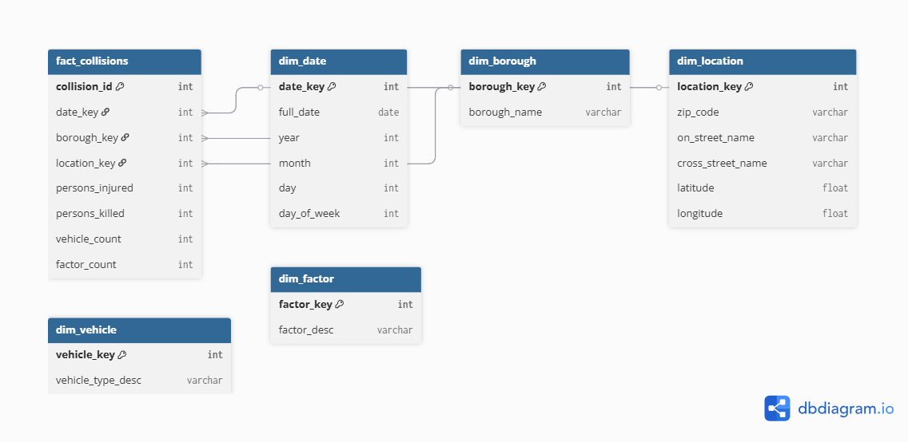

# Step 2.3 – Dimensional Modeling & ETL (Optional)

## Star Schema Diagram


## Star Schema Overview
To support analytical queries, I designed a star schema with a central fact table and several supporting dimension tables.

### Grain of the Fact Table
The grain of the fact table is **one row per collision**, identified by `collision_id`.  
That means each row in the fact table represents a single collision event from the OLTP `collisions` table.

### Fact Table: `fact_collisions`

**Measures**

- `persons_injured`  
- `persons_killed`  
- `pedestrians_injured`  
- `pedestrians_killed`  
- `cyclists_injured`  
- `cyclists_killed`  
- `motorists_injured`  
- `motorists_killed`  
- `vehicle_count`  
- `factor_count`  

**Foreign keys**

- `date_key` → `dim_date`  
- `borough_key` → `dim_borough`  
- `location_key` → `dim_location`  

This design lets me aggregate injuries, fatalities, and counts across time, borough, and location.

### Dimension Tables

#### `dim_date`
Stores calendar information so I can analyze trends over time.

- `date_key` (PK)  
- `full_date`  
- `year`  
- `month`  
- `day`  
- `day_of_week`  
- `is_weekend`  

#### `dim_borough`
Stores information about the NYC boroughs.

- `borough_key` (PK)  
- `borough_name`  

#### `dim_location`
Stores the main location context of a collision.

- `location_key` (PK)  
- `zip_code`  
- `on_street_name`  
- `cross_street_name`  
- `latitude`  
- `longitude`  

#### `dim_vehicle` (optional)
Designed for future vehicle-level analysis.

- `vehicle_key` (PK)  
- `vehicle_type_desc`  

#### `dim_factor` (optional)
Designed for future analysis of contributing factors.

- `factor_key` (PK)  
- `factor_desc`  

In this first version of the warehouse, the fact table focuses on collision-level metrics, but these two dimensions can be used later for a more detailed fact table (one row per collision per vehicle or per factor).

---

## ETL / dbt Overview

The ETL process loads OLTP data into the dimensional model using **dbt**. The idea is:

1. Read from the raw OLTP tables
2. Clean and stage the data
3. Build dimension tables
4. Build the `fact_collisions` fact table at the collision grain

### ETL Steps

1. **Staging**  
   dbt staging models select from the raw OLTP tables and standardize column names and types. Example staging models:
   - `stg_collisions` (from `collisions`)
   - `stg_collision_vehicles` (from the vehicle table)
   - `stg_collision_factors` (from the factors table)
   - `stg_boroughs` (from the borough table)

2. **Dimension Building**  
   dbt models then build:
   - `dim_date` (date spine)
   - `dim_borough` (from `stg_boroughs`)
   - `dim_location` (from distinct locations in `stg_collisions`)
   - `dim_vehicle` (from distinct vehicle types)
   - `dim_factor` (from distinct factors)

3. **Fact Table**  
   The `fact_collisions` model joins staged collisions with the dimensions and aggregates vehicles and factors at the collision grain.

### Example dbt Model for `fact_collisions`

```sql
select
    c.collision_id,
    d.date_key,
    b.borough_key,
    l.location_key,
    count(distinct v.vehicle_id) as vehicle_count,
    count(distinct f.factor_id) as factor_count,
    c.number_of_persons_injured as persons_injured,
    c.number_of_persons_killed  as persons_killed,
    c.number_of_pedestrians_injured as pedestrians_injured,
    c.number_of_pedestrians_killed  as pedestrians_killed,
    c.number_of_cyclist_injured     as cyclists_injured,
    c.number_of_cyclist_killed      as cyclists_killed,
    c.number_of_motorist_injured    as motorists_injured,
    c.number_of_motorist_killed     as motorists_killed
from stg_collisions c
left join dim_date d
    on d.full_date = c.crash_date
left join dim_borough b
    on b.borough_name = c.borough
left join dim_location l
    on l.zip_code = c.zip_code
left join stg_collision_vehicles v
    on v.collision_id = c.collision_id
left join stg_collision_factors f
    on f.collision_id = c.collision_id
group by
    c.collision_id,
    d.date_key,
    b.borough_key,
    l.location_key;
